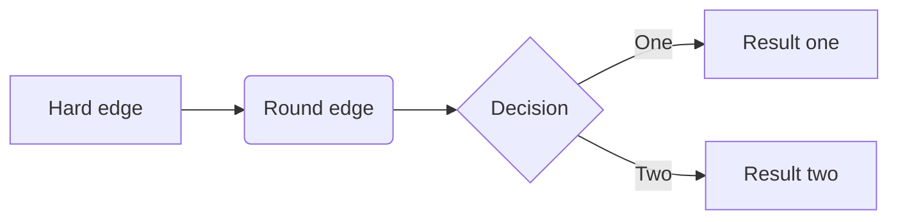

# Drone Lidar Path Optimization

Given a lidar point cloud and a drone's positions, this application calculates the optimum path that a drone should traverse from one end to another.

## Getting Started

This application is written in Python3. Please follow the following steps to run this application.

### Prerequisites

Please make sure that you are using python3 to run this application

### Cloning this Repository

To clone this repository, please make sure that you have installed git.
Then execute the following:

```shell script
git clone https://github.com/bldulam1/lidar-drone-path-optimization
```
### Installing Dependencies

To install the package dependencies, please install the packages in the `requirements.txt`.

Please go to this project's directory then execute the following in the shell

```shell script
cd lidar-drone-path-optimization
pip install -r ./requirements.txt
```

### Predefined tests
To test the solution to the challenges, please use the following tests, by executing through the shell.

_Please make sure that you are in the directory of this repository when executing the following commands._

##### Display
```shell script
python main.py --lp_csv ./.cache/LIDARPoints.csv --fp_csv ./.cache/FlightPath.csv -v --challenge 1
```

##### Simulation
```shell script
python main.py --m_csv ./.cache/Mapping.csv --lp_csv ./.cache/lp.csv --fp_csv ./.cache/FlightPath.csv -v --challenge 2
```

##### Flight Optimization
```shell script
python main.py --m_csv ./.cache/Mapping.csv --lp_csv ./.cache/LIDARPoints.csv --fp_csv ./.cache/fp.csv -v --start_x 11e3 --start_y 4e3 --end_x 2.5e3 --end_y 12e3 --challenge 3
```


##### Flight Reroute
```shell script
python main.py --m_csv ./.cache/Mapping.csv --lp_csv ./.cache/LIDARPoints.csv --fp_csv ./.cache/fp.csv -v --start_x 11e3 --start_y 4e3 --end_x 2.5e3 --end_y 12e3 --challenge 4
```

##### Mapping
```shell script
python main.py --m_csv ./.cache/Mapping.csv --lp_csv ./.cache/LIDARPoints.csv --fp_csv ./.cache/FlightPath.csv -v --challenge 5
```


#### Description of Command Line Arguments
The following shows the description of the command line arguments of the application.

|     Flag    	|                             Description                             	| Default Value 	|              Example             	|
|:-----------:	|:-------------------------------------------------------------------:	|---------------	|:--------------------------------:	|
| --challenge 	|                    Specifies the challenge number                   	|               	| --challenge 3                    	|
| --lp_csv    	|                         lidar point csv file                        	|               	| --lp_csv ./.cache/lp.csv         	|
| --fp_csv    	|                         flight path csv file                        	|               	| --fp_csv ./.cache/FlightPath.csv 	|
| --m_csv     	|                           mapping csv file                          	|               	| --m_csv ./.cache/Mapping.csv     	|
| --start_x   	|  x-coordinate of the starting point, required in challenges 3 and 4 	|               	| --start_x 11e3                   	|
| --start_y   	| y-coordinate of the starting point,  required in challenges 3 and 4 	|               	| --start_y 4e3                    	|
| --end_x     	|    x-coordinate of the end point,  required in challenges 3 and 4   	|               	| --end_x 2.5e3                    	|
| --end_y     	|    y-coordinate of the end point,  required in challenges 3 and 4   	|               	| --end_y 12e3                     	|
| -v          	|          verbose,  displays each major step in the program          	|               	| -v                               	|


#### Explanation of the Solution
##### Display




## Package Dependencies
* [pandas](https://pandas.pydata.org/docs/)
* [numpy](https://numpy.org/)
* [matplotlib](https://matplotlib.org/)


## Author

* **Brendon Dulam** - *Veoneer Japan* - [bldulam1](https://github.com/bldulam1) - [portfolio](https://bdulam.netlify.com)


## License

This project is licensed under the MIT License - see the [LICENSE.md](./LICENSE.md) file for details

## Acknowledgments

* Dijkstra Algorithm [video](https://www.youtube.com/watch?v=gdmfOwyQlcI&t=229s)
